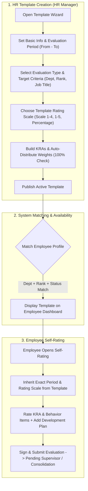

# Implementation Plan: Evaluation Period & Template Creation Enhancement

Enhance the **Evaluation Template Creation & Editing** module in `Raquel_HRD` by integrating:
1. **Evaluation Period (`From:` and `To:`)** date selection with quick preset buttons for all evaluation types.
2. **Smart Calculation & Validation Helpers** (live KRA weight progress bar, "Auto-Distribute KRA Weights" button, live 100% split balance checker).
3. **Granular Targeting & Routing** (Target Rank Category and Job Title selection alongside Department targeting).
4. **Scoring & Rating Scale Customization** (Template-level rating scale selector: `Scale 1-4`, `Scale 1-5`, `Scale 1-10`, `Percentage`).

---

## Operational Workflow Visualization (End-to-End Functionality)

---

## User Review Required

> [!IMPORTANT]
> **Database Schema Alteration**: This update adds 5 new columns to the `evaluation_templates` database table: `evaluation_period_start`, `evaluation_period_end`, `target_rank_category_id`, `target_job_title_id`, and `default_scoring_method`. A migration query will automatically run if the columns do not exist.

> [!NOTE]
> **Probationary Evaluation Period Behavior**: For `Initial` (+3M) and `Final` (+6M) evaluation types, HR can either pick explicit template period dates or click the **"Calculate from Hire Date"** quick preset button.

---

## Open Questions

> [!IMPORTANT]
> 1. **Existing Active Templates**: Should existing templates in the database be backfilled with default date ranges (e.g., current calendar year `2026-01-01` to `2026-12-31`), or left as `NULL` until HR edits them?
> 2. **Rating Scale Override**: Should individual criteria items still allow overriding the scoring scale, or should all criteria in a template strictly inherit the Template's Default Rating Scale? (Recommended: Default to Template Scale, but allow item override if needed).

---

## Proposed Changes

---

### Database Schema

#### [MODIFY] [1st_schema_tables.sql](file:///c:/xampp/htdocs/Raquel_HRD/database/1st_schema_tables.sql#L396-L415)
* Update `evaluation_templates` definition:
  * Add `evaluation_period_start DATE NULL`
  * Add `evaluation_period_end DATE NULL`
  * Add `target_rank_category_id INT NULL` (FK to `rank_categories`)
  * Add `target_job_title_id INT NULL` (FK to `job_titles`)
  * Add `default_scoring_method ENUM('Scale_1_4','Scale_1_5','Scale_1_10','Percentage') DEFAULT 'Scale_1_4'`

---

### Core Helper & Setup Utilities

#### [MODIFY] [functions.php](file:///c:/xampp/htdocs/Raquel_HRD/includes/functions.php#L2090-L2115)
* Add automated database migration safety check to `functions.php` to ensure columns (`evaluation_period_start`, `evaluation_period_end`, `target_rank_category_id`, `target_job_title_id`, `default_scoring_method`) are safely added via `ALTER TABLE` if missing.
* Update `ensureEvaluationPackage()` to inherit period dates from `evaluation_templates` when creating or syncing package groups.

---

### HR Manager Template Creation & Editing

#### [MODIFY] [create-template.php](file:///c:/xampp/htdocs/Raquel_HRD/manager/create-template.php#L1-L100)
1. **Step 1: Template Information & Period**:
   * Add **Evaluation Period From** (`<input type="date" name="evaluation_period_start">`) and **To** (`<input type="date" name="evaluation_period_end">`).
   * Add Quick Date Preset buttons: `[Current Quarter]`, `[Current Year]`, `[Probationary +3M]`, `[Probationary +6M]`.
   * Add dropdowns for **Target Rank Category** (`target_rank_category_id`) and **Target Job Title** (`target_job_title_id`) populated dynamically from DB.
2. **Step 2 & 3: Smart KRA Weight Helpers**:
   * Add a real-time **KRA Weight Progress Bar** showing total item weights sum (`0% - 100%`).
   * Add **"Auto-Distribute Weights"** button to evenly split 100% across all active KRA rows.
   * Add real-time KRA % + Behavior % = 100% Master Split balance indicator.
3. **Step 5: Rating Scale Selector & Submission**:
   * Add Template-level **Rating Scale Selector** (`Scale 1-4`, `Scale 1-5`, `Scale 1-10`, `Percentage`).
   * Save new fields (`evaluation_period_start`, `evaluation_period_end`, `target_rank_category_id`, `target_job_title_id`, `default_scoring_method`) into `evaluation_templates`.

#### [MODIFY] [edit-template.php](file:///c:/xampp/htdocs/Raquel_HRD/manager/edit-template.php#L1-L85)
* Update `SELECT` query, form rendering, and `UPDATE` statement to load, display, and save `evaluation_period_start`, `evaluation_period_end`, `target_rank_category_id`, `target_job_title_id`, and `default_scoring_method`.
* Include the live weight progress bar, auto-distribute button, preset date buttons, and rating scale selector.

---

### Template Management & Views

#### [MODIFY] [templates.php](file:///c:/xampp/htdocs/Raquel_HRD/manager/templates.php)
* Display Evaluation Period badge (e.g. `Period: Jan 01, 2026 – Dec 31, 2026`), Target Rank/Job Title badge, and Scoring Scale indicator on template cards.

#### [MODIFY] [view-template.php](file:///c:/xampp/htdocs/Raquel_HRD/staff/view-template.php)
* Render period dates, target rank/job title details, and rating scale metadata in template detail view.

---

### Employee Self-Rating & Evaluation Flows

#### [MODIFY] [self-rating.php](file:///c:/xampp/htdocs/Raquel_HRD/employee/self-rating.php#L258-L300)
* When an evaluation is initialized from a template, set `evaluation_period_start` and `evaluation_period_end` directly from the template's stored dates.
* Adapt rating scale UI controls according to the template's `default_scoring_method`.

---

## Verification Plan

### Automated Tests
* Execute PHP syntax and database column verification script in `scratch/` to confirm migration columns and table structure.

### Manual Verification
1. **Create Template Test**:
   * Open `manager/create-template.php`.
   * Click quick preset `[Current Year]` to verify date inputs fill with `2026-01-01` to `2026-12-31`.
   * Select a target Department, Rank Category, and Job Title.
   * Add 4 KRA items, click **"Auto-Distribute Weights"**, and verify each row gets `25.00%` and the progress bar shows `100% (Balanced)`.
   * Select rating scale `Scale 1-5` and save template.
2. **Edit Template Test**:
   * Open `manager/edit-template.php?id=X`.
   * Modify the evaluation period dates and target rank category. Save and verify database update.
3. **Self-Rating Test**:
   * Log in as an employee, create a self-rating evaluation using the new template.
   * Verify evaluation period dates match the template's dates.
